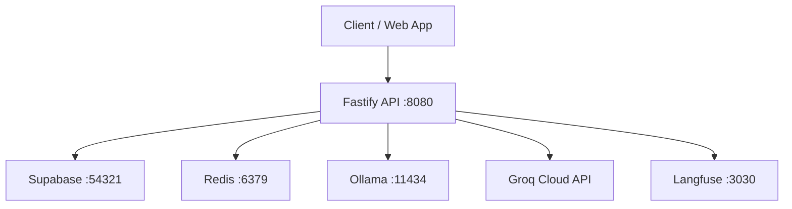

# System Architecture

## Purpose

Hive is a Bangladesh-focused AI API gateway that provides an OpenAI-compatible aggregation layer over multiple LLM providers with local payment workflows.

## High-Level Components



### 1. API Service (`apps/api`)
- Fastify HTTP server
- OpenAI-compatible endpoints (`/v1/chat/completions`, `/v1/responses`, `/v1/images/generations`)
- Billing and payment endpoints
- Provider status endpoints (public + admin-protected)
- Provider metrics endpoints (public-safe JSON, admin JSON, admin Prometheus text)

### 2. Web App (`apps/web`)
- Next.js App Router UI
- Chat-first workspace with developer panel and settings surfaces
- Browser clients require explicit `NEXT_PUBLIC_API_BASE_URL`, `NEXT_PUBLIC_SUPABASE_URL`, and `NEXT_PUBLIC_SUPABASE_ANON_KEY`; the web app no longer falls back to localhost or placeholder credentials at runtime
- The browser maintains a small mirrored auth-session store for app routing and API headers, but Supabase remains the source of truth. The mirror is synchronized from `getSession()` and `onAuthStateChange()` without clearing seeded local sessions until a real Supabase session has been observed.
- Protected routes must wait for client auth-session hydration before redirecting to `/auth`; prerendered `null` auth state is not sufficient evidence that the browser is unauthenticated.

### 3. Supabase (Auth + Persistence)
- **Auth**: User registration, login, OAuth, MFA — all handled by Supabase Auth
- **User Profiles**: `user_profiles` table via `SupabaseUserStore`
- **API Keys**: Hashed key metadata in `api_keys` table via `SupabaseApiKeyStore`
- **API Key Metadata Shape**: Persisted records expose only a non-secret `key_prefix` plus scopes/revocation metadata; plaintext API keys are never returned after creation
- **Billing**: Credit accounts, ledger, payment intents/events via `SupabaseBillingStore`
- **RBAC**: `user_roles` + `role_permissions` tables queried by `AuthorizationService`
- **Settings**: `user_settings` table for feature gates

### 4. Redis
- Rate limiting and short-window traffic control

### 5. Ollama
- Local model inference runtime

### 6. Langfuse (Self-hosted)
- LLM observability, tracing, and analytics
- Runs as a Docker container with its own dedicated Postgres (`langfuse-db`)

### 7. External Integrations
- Groq API for hosted inference
- bKash/SSLCOMMERZ payment webhooks

## Request Lifecycle (Chat)

1. Bearer token validated against Supabase Auth (`SupabaseAuthService`)
2. Redis rate-limit check
3. Model selection (`fast-chat`, `smart-reasoning`, etc.)
4. Credit debit attempt via `SupabaseBillingStore`
5. Provider registry execution with fallback chain and circuit breaker
6. Usage event persisted
7. Trace sent to Langfuse (if enabled)
8. Response returned with routing headers

## Billing and Ledger Architecture

- Credits are tracked as application entitlements (not wallet cash balance)
- Conversion: `1 BDT = 100 AI Credits` (top-up), `100 AI Credits = 0.9 BDT` (refund)
- Refundable only if unused purchased credits and within configured window
- Payment events are idempotent via provider transaction event keys
- All billing data stored in Supabase: `credit_accounts`, `credit_ledger`, `payment_intents`, `payment_events`

## Provider Routing Architecture

| Model | Primary | Fallback 1 | Fallback 2 |
|-------|---------|------------|------------|
| `fast-chat` | Ollama | Groq | Mock |
| `smart-reasoning` | Groq | Ollama | Mock |
| `image-basic` | Mock | — | — |

Circuit breaker protects against cascading provider failures:
- **CLOSED** → normal operation
- **OPEN** → provider skipped until reset timeout
- **HALF_OPEN** → single test request to check recovery

## Security Boundaries

- Public provider status never returns internal error details
- Public provider metrics never return provider diagnostic detail or raw circuit-breaker internals
- Internal diagnostics require `ADMIN_STATUS_TOKEN` header
- All Supabase tables use Row Level Security (RLS)
- API keys are stored as SHA-256 hashes; raw keys are never persisted
- Bearer tokens are validated server-side via Supabase Auth
- Browser runtime configuration fails closed when required public env vars are missing

## Operational Dependencies

The API requires:
- Supabase (Auth + Postgres) — for all persistence and authentication
- Redis — for rate limiting

Provider health depends on:
- Ollama availability and pulled model
- Groq API key validity and network reachability

Provider metrics are:
- collected in-process inside the API provider registry
- exposed through pull-based endpoints only
- reset on API restart because they are in-memory per API instance

## Docker Topology

```
┌─────────────────────────────────────────────────────┐
│  docker compose                                      │
│  ┌──────┐ ┌──────┐ ┌─────┐ ┌─────┐                 │
│  │ api  │ │ web  │ │redis│ │oll- │                  │
│  │ :8080│ │ :3000│ │:6379│ │ama  │                  │
│  └──┬───┘ └──────┘ └─────┘ │:1143│                  │
│     │                       │ 4   │                  │
│  ┌──┴────────┐ ┌──────────┐└─────┘                  │
│  │ langfuse  │ │langfuse- │                          │
│  │ :3030     │ │db :5434  │                          │
│  └───────────┘ └──────────┘                          │
└─────────────────────────────────────────────────────┘
          │
          ▼ host.docker.internal
┌─────────────────┐
│ Supabase CLI     │
│ :54321 (API)     │
│ :54322 (Postgres)│
│ :54323 (Studio)  │
└─────────────────┘
```

Supabase is managed by the Supabase CLI on the host and the API container reaches it via `host.docker.internal`.
