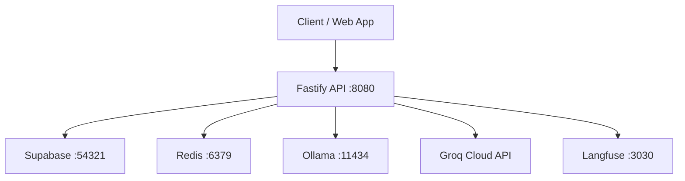

# System Architecture

## Purpose

Hive is an AI inference platform that provides an OpenAI-compatible aggregation layer over multiple LLM providers, prepaid billing controls, and operator-safe observability. Bangladesh-native payment workflows remain one market wedge, not the full product definition.

## High-Level Components



### 1. API Service (`apps/api`)
- Fastify HTTP server
- OpenAI-compatible endpoints (`/v1/chat/completions`, `/v1/responses`, `/v1/images/generations`)
- Billing and payment endpoints
- Provider status endpoints (public + admin-protected)
- Provider metrics endpoints (public-safe JSON, admin JSON, admin Prometheus text)

### 2. Web App (`apps/web`)
- Next.js App Router UI
- Chat-first workspace with guest-first home, developer panel, and settings surfaces
- Browser clients require explicit `NEXT_PUBLIC_API_BASE_URL`, `NEXT_PUBLIC_SUPABASE_URL`, and `NEXT_PUBLIC_SUPABASE_ANON_KEY`; the web app no longer falls back to localhost or placeholder credentials at runtime
- In local Docker-based development, those browser envs and the API's `SUPABASE_SERVICE_ROLE_KEY` must come from the live Supabase CLI stack (`npx supabase status -o env`), not placeholder defaults
- The browser maintains a small mirrored auth-session store for app routing and API headers, but Supabase remains the source of truth. The mirror is synchronized from `getSession()` and `onAuthStateChange()` without clearing seeded local sessions until a real Supabase session has been observed.
- The home route `/` is guest-accessible by default. Guest chat bootstraps a signed `httpOnly` guest cookie plus a mirrored browser-visible guest session object, is limited to models with `costType: "free"`, rejects non-same-origin browser traffic, and forwards the client IP plus validated `guestId` to the API for guest rate limiting and attribution.
- The home model picker keeps paid chat models visible for guests as locked entries with the reason `Requires account and credits`; selecting one opens a dismissible combined auth modal on `/` rather than navigating away.
- Successful auth from that modal updates the mirrored auth-session store and unlocks paid models in place on `/`, preserving the current conversation state.
- Protected routes must wait for client auth-session hydration before redirecting to `/auth`; prerendered `null` auth state is not sufficient evidence that the browser is unauthenticated.

### 3. Supabase (Auth + Persistence)
- **Auth**: User registration, login, OAuth, MFA — all handled by Supabase Auth
- **User Profiles**: `user_profiles` table via `SupabaseUserStore`
- **API Keys**: Hashed key metadata in `api_keys` plus immutable lifecycle history in `api_key_events`, managed via `SupabaseApiKeyStore`
- **API Key Metadata Shape**: Persisted records expose a stable key id, non-secret `key_prefix`, nickname, scopes, expiration, and revocation metadata; plaintext API keys are never returned after creation
- **API Key Lifecycle**: Creation, revocation, and first observed expiry are recorded as immutable audit events for developer visibility and operator investigations
- **Billing**: Credit accounts, ledger, payment intents/events via `SupabaseBillingStore`
- **RBAC**: `user_roles` + `role_permissions` tables queried by `AuthorizationService`
- **Settings**: `user_settings` table for feature gates
- **Guest Attribution**: `guest_sessions`, `guest_usage_events`, and `guest_user_links` via `SupabaseGuestAttributionStore`
- **Chat History**: `chat_sessions` and `chat_messages` via `SupabaseChatHistoryStore`; guest-owned sessions are claimed for the user when linking guest to account

### 4. Redis
- Rate limiting and short-window traffic control

### 5. Ollama
- Local model inference runtime

### 6. Langfuse (Self-hosted)
- LLM observability, tracing, and analytics
- Runs as a Docker container with its own dedicated Postgres (`langfuse-db`)

### 7. External Integrations
- OpenRouter, OpenAI, Groq, Gemini, and Anthropic APIs for hosted inference
- bKash/SSLCOMMERZ payment webhooks

## Product Posture

Hive currently sits between a narrow gateway and a full multi-tenant inference platform.

Already platform-like:
- compatible inference API surface
- provider routing and fallback
- public/internal provider health boundaries
- billing ledger and reconciliation
- managed API-key lifecycle
- lightweight web and developer surfaces

Still missing for a fuller platform posture:
- dynamic provider/catalog management and pricing automation
- richer analytics and operator tooling
- organization/team controls
- stronger deployment and SLO guidance

## Product Pipelines And Analytics

Hive currently has two commercial/product pipelines that should not be conflated in reporting:

- `api`: the OpenAI-compatible API business
- `web`: the chat product business

Reporting and attribution should reflect that split even when runtime infrastructure is temporarily shared. API-product traffic should stay tagged `api` and include a stable API-key identifier when available. Web chat traffic, including guest chat and authenticated web chat, should stay tagged `web`.
While authenticated web chat still shares the public inference runtime path, its reporting classification should come from trusted browser-origin signals rather than a caller-controlled product hint header.

The current implementation separates analytics/reporting first. Authenticated web chat still executes through shared inference endpoints today; a deeper runtime split away from the public OpenAI-compatible API path remains a follow-up tracked in GitHub issue `#57`.

## Request Lifecycle (Chat)

Authenticated chat:

1. Bearer token validated against Supabase Auth (`SupabaseAuthService`) or API key resolution
2. Redis rate-limit check
3. Model selection (`fast-chat`, `smart-reasoning`, etc.)
4. If the selected public model has positive cost, attempt credit debit via `SupabaseBillingStore`; zero-cost public models skip this step
5. Provider registry execution with fallback chain and circuit breaker or with zero-cost offer routing when the public model is `guest-free`
6. Usage event persisted with `channel = "api"` for API-product traffic and `channel = "web"` for session-authenticated web chat traffic
7. Trace sent to Langfuse (if enabled)
8. Response returned with routing headers

Guest web chat:

1. Browser stays on `/` without auth and bootstraps a guest session through `/api/guest-session`
2. The Next.js route issues a signed guest cookie, mirrors a browser-visible guest session object, and persists/refreshes the guest session through the internal API
3. The model picker exposes free models normally and renders paid models as locked options with an in-place auth upsell
4. Browser creates/sends guest chat through `/api/chat/guest/sessions` (list, create, get, send messages); legacy completion path remains at `/api/chat/guest`
5. The Next.js guest route rejects non-same-origin requests and forwards the internal request with a server-only token, validated `guestId`, and caller IP
6. Redis rate-limit check uses a guest key derived from the forwarded client IP
7. Requested model is validated against guest policy (`costType === "free"`)
8. Provider registry executes only the guest-safe model and records usage under `guest_usage_events`
9. No credit debit occurs
10. Response returns without spilling into paid models

Guest-to-user conversion linkage:

1. Guest selects a locked paid model and opens the combined auth modal on `/`
2. Browser later authenticates through Supabase Auth without leaving the current chat surface
3. The web auth/session sync posts to `/api/guest-session/link` when a guest session is present
4. The web route validates the signed guest cookie and forwards the link request to the API with the internal token plus authenticated bearer token
5. The API resolves the authenticated user and persists the durable `guestId -> userId` link in `guest_user_links`
6. The refreshed auth-session store causes paid models to unlock in place on `/`

## Billing and Ledger Architecture

- Credits are tracked as application entitlements (not wallet cash balance)
- Conversion: `1 BDT = 100 AI Credits` (top-up), `100 AI Credits = 0.9 BDT` (refund)
- Payment credit conversion must use decimal-safe arithmetic so valid 2-decimal payment amounts are not under-credited or falsely flagged during reconciliation
- Refundable only if unused purchased credits and within configured window
- Payment events are idempotent via provider transaction event keys
- All billing data stored in Supabase: `credit_accounts`, `credit_ledger`, `payment_intents`, `payment_events`
- Payment reconciliation checks recent `payment_intents`, `payment_events`, and `credit_ledger` payment entries together; credited intent state alone is not sufficient evidence that billing is consistent

## Provider Routing Architecture

Public model ids stay stable at the API boundary, while the registry can route them through internal provider offers.

| Public model | Routing policy |
|--------------|----------------|
| `guest-free` | zero-cost offers only from configured `ollama`, `openrouter`, `openai`, `groq`, `gemini`, or `anthropic` offers; fail closed if none are healthy |
| `fast-chat` | primary `ollama`, fallback `groq`, then `mock` |
| `smart-reasoning` | primary `groq`, fallback `ollama`, then `mock` |
| `image-basic` | primary `openai`, fallback `mock` |

OpenRouter, OpenAI, Groq, and Gemini share an internal OpenAI-compatible chat transport. Anthropic uses a native Messages adapter internally and is translated back into OpenAI-compatible response objects before returning to clients.

Circuit breaker protects against cascading provider failures:
- **CLOSED** → normal operation
- **OPEN** → provider skipped until reset timeout
- **HALF_OPEN** → single test request to check recovery

## Security Boundaries

- Public provider status never returns internal error details
- Public provider metrics never return provider diagnostic detail or raw circuit-breaker internals
- Internal diagnostics require `ADMIN_STATUS_TOKEN` header
- All Supabase tables use Row Level Security (RLS)
- API keys are stored as SHA-256 hashes; raw keys are never persisted
- Bearer tokens are validated server-side via Supabase Auth
- Browser runtime configuration fails closed when required public env vars are missing
- Guest attribution stays behind a web-server boundary: the browser talks to Next.js routes, while the API accepts guest attribution writes only through internal token-protected routes

## Operational Dependencies

The API requires:
- Supabase (Auth + Postgres) — for all persistence and authentication
- Redis — for rate limiting

Provider health depends on:
- Ollama availability and pulled model
- Groq API key validity and network reachability
- OpenRouter API key validity and network reachability
- OpenAI API key validity and network reachability
- Gemini API key validity and network reachability
- Anthropic API key validity and network reachability

Provider metrics are:
- collected in-process inside the API provider registry
- exposed through pull-based endpoints only
- reset on API restart because they are in-memory per API instance

Payment reconciliation scheduling is:
- opt-in via environment configuration
- started immediately on API startup, then repeated on a fixed interval
- process-local per API instance, so multi-replica deployments should enable it on only one instance until coordination exists

## Docker Topology

```
┌─────────────────────────────────────────────────────┐
│  docker compose                                      │
│  ┌──────┐ ┌──────┐ ┌─────┐ ┌─────┐                 │
│  │ api  │ │ web  │ │redis│ │oll- │                  │
│  │ :8080│ │ :3000│ │:6379│ │ama  │                  │
│  └──┬───┘ └──────┘ └─────┘ │:1143│                  │
│     │                       │ 4   │                  │
│  ┌──┴────────┐ ┌──────────┐└─────┘                  │
│  │ langfuse  │ │langfuse- │                          │
│  │ :3030     │ │db :5434  │                          │
│  └───────────┘ └──────────┘                          │
└─────────────────────────────────────────────────────┘
          │
          ▼ host.docker.internal
┌─────────────────┐
│ Supabase CLI     │
│ :54321 (API)     │
│ :54322 (Postgres)│
│ :54323 (Studio)  │
└─────────────────┘
```

Supabase is managed by the Supabase CLI rather than Hive's Compose file, but it still runs as Docker containers under the hood. The API container reaches that stack via `host.docker.internal`. For a working local or CI app runtime, the Supabase CLI stack and the Hive Docker app stack have to run together; neither one is sufficient on its own.

The standardized local workflow is split deliberately:

- `pnpm bootstrap:local` for first-time schema/bootstrap, migration application, and default local Ollama model provisioning
- `pnpm stack:dev` for daily full-stack development with hot reload

## Why API And Web Are Separate Containers

Hive keeps `api` and `web` as separate containers because they are separate applications with different runtime concerns:

- `api` is the backend service that owns auth validation, provider routing, billing, and persistence access
- `web` is the browser-facing Next.js application that consumes the API over HTTP and owns the browser-trusted guest-session boundary

This separation is useful even in local development because it:

- preserves the real browser-to-API boundary
- catches env and network wiring problems early
- makes it obvious which values are safe for browser exposure (`NEXT_PUBLIC_*`) versus server-only secrets
- lets the web production bundle be validated independently from the API runtime

The standardized daily-development workflow is `pnpm stack:dev`, which combines the Supabase CLI lifecycle with a Docker Compose dev override so `api` and `web` keep hot reload while still running as part of the full stack. That path injects a local-only guest proxy token for the web guest-chat boundary. First-time local setup should run `pnpm bootstrap:local` before that daily workflow. The GitHub web smoke workflow mirrors the same Supabase-CLI-plus-Docker conjunction against the live `supabase/migrations/` path, but intentionally omits Ollama because the smoke suite does not validate local inference.
