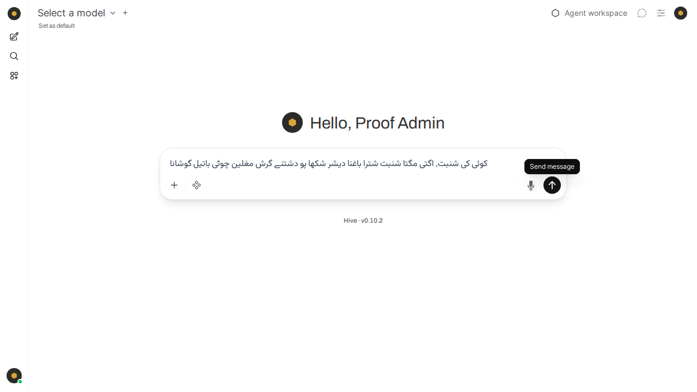
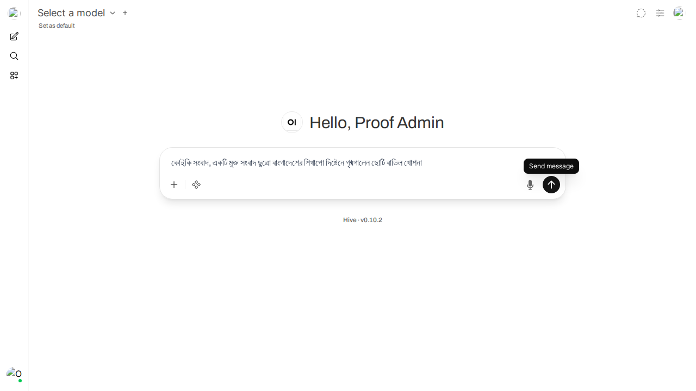

# Bengali dictation, before and after (2026-08-17)

Visual proof for the fix that routes Open WebUI's speech-to-text through the
Hive gateway. Both captures drive **Open WebUI's own composer microphone** in a
real browser against a running stack, with the same audio and the same UI. Only
the configuration differs.

## The audio is real Bengali speech

`Bn-বাংলাদেশের শিক্ষাপ্রতিষ্ঠানে গ্রীষ্মকালীন ছুটি বাতিল ঘোষিত.wav`, a Bengali
Wikinews spoken article from Wikimedia Commons (CC BY-SA), trimmed to 12
seconds. Not a synthesizer, and not a fixture string.

Chromium's own `--use-file-for-fake-audio-capture` was tried first and mangled
the recording (its capture came back as garbled English), so the microphone
signal is fed through WebAudio instead: `getUserMedia` returns a
`MediaStreamAudioDestinationNode` playing that file. Everything downstream is
untouched product code, Open WebUI's own `MediaRecorder`, its own upload to
`/api/v1/audio/transcriptions`, and its own insertion into the composer.

## Before: `audio.stt.engine = ""` (what the demo box runs today)



Open WebUI transcribes in-container with the `WHISPER_MODEL=base` the upstream
image bakes in. It never produces Bengali script. Across runs it produced
romanized Latin (`bhoi ki shambhat, ek dimu gta shambhat chutra...`) and, in the
captured run, Urdu script, which is the same failure wearing a different
alphabet: the model guessed a language it can write and transliterated into it.

## After: `audio.stt.engine = "openai"` pointed at `hive-stt`



Composer text, Bengali script:

```
কোইকি সংবাদ, একটি মুক্ত সংবাদ ছুত্রো বাংগাদেশের শিখাপো দিষ্টেনে গৃষ্মগালেন ছোটি বাতিল খোশনা
```

The request left the container: Open WebUI logged
`transcribe: /data/cache/audio/transcriptions/<id>.webm None` with no
`Detected language` line, which is the in-container decoder's own log and is
absent because it never ran. edge-api resolved `hive-stt` to
`groq/whisper-large-v3` and priced it per second.

This also closes the rendering question: the interface renders Bengali script
correctly, so there is no font or shaping defect to file. The old path simply
never produced Bengali for it to render.

## Reconcile, on an already-booted database

The four keys are Open WebUI persistent config, so the compose values alone
would be a no-op on a deployment that has booted before. Boot log from the
container used for these captures:

```
hive: reconciled Open WebUI config from env: audio.stt.engine=openai,
audio.stt.model=hive-stt, audio.stt.openai.api_base_url=http://edge-api:8080/v1,
audio.stt.openai.api_key, automations.enable=False, calendar.enable=False,
notes.enable=False, rag.embedding_engine=openai,
rag.embedding_model=hive-embedding-default, rag.enable_hybrid_search=False,
rag.openai.api_base_url=http://edge-api:8080/v1, rag.openai.api_key,
ui.enable_login_form=False
```

The alias is named, the key is not. Booting the same image on the same volume
with the four variables unset left the persisted values untouched, which is what
keeps an Enterprise box running the sovereign `voice` profile unaffected.

## Reading these images

Two cosmetic notes so neither is mistaken for a regression. The avatar and logo
tiles in the "after" capture are broken images because this scratch container's
static asset bind was lost by Docker Desktop mid-session, not by any change in
this PR. The account is a run-scoped fixture ("Proof Admin"), never the owner's,
and no owner data was read or written.
