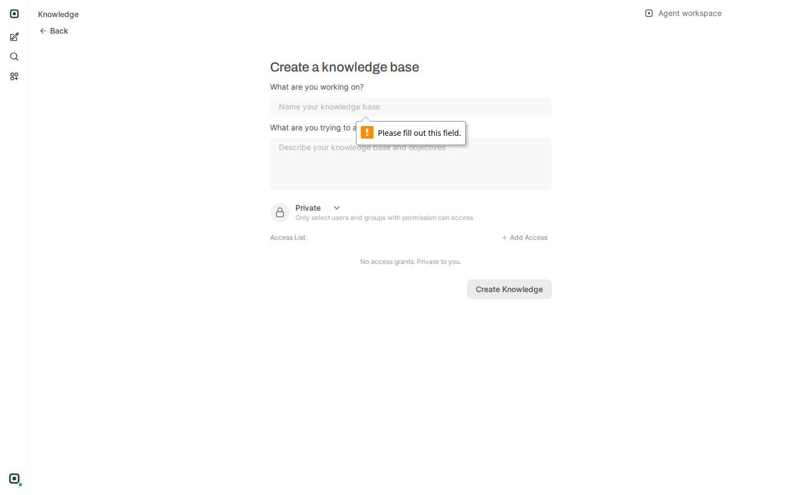
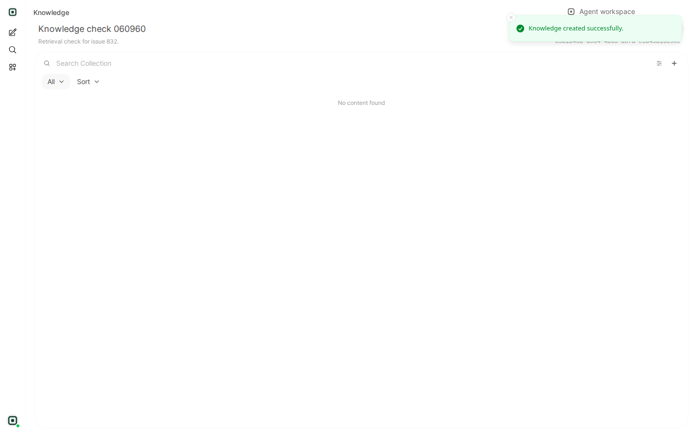
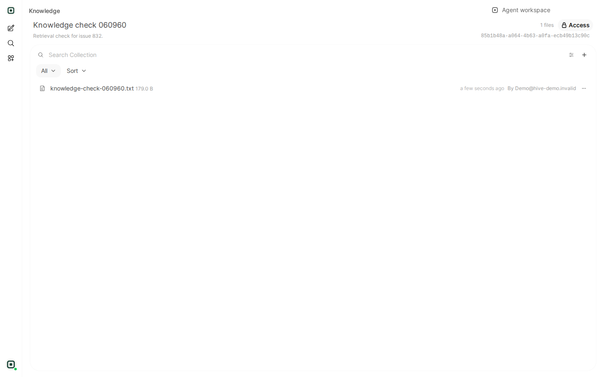
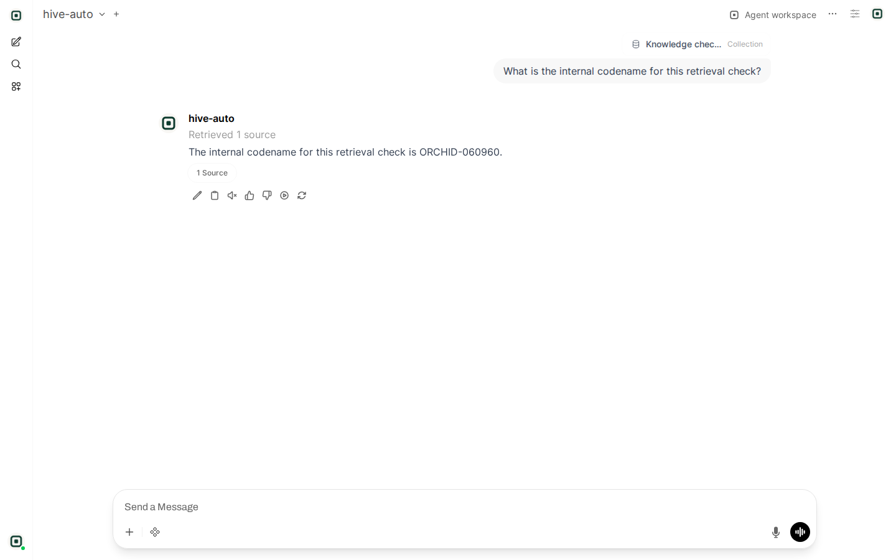

# Knowledge work end to end, demo box, 2026-08-11 (issue #832)

Captured live against `https://chat-hive.scubed.co` with the shared demo
account, signed in through the audited magic-link helper
(`apps/web-console/tests/e2e/support/live-auth.mjs`, see `docs/live-test-auth.md`).
No password was set, reset or rotated. Every collection created for this run
was deleted afterwards.

## What #832 reported, and what it actually is

The report was that Create Knowledge on an empty form "does nothing and
explains nothing": no network call, no DOM mutation, no message.

The first two are correct and the third is not. Both fields on the upstream
form carry the HTML5 `required` attribute and the form sets no `novalidate`,
so the browser's own constraint validation refuses the submit before Svelte's
handler ever runs. That is why an automated gate sees zero mutations and zero
requests: a native validation bubble is painted by the browser, not inserted
into the DOM, so a MutationObserver cannot see it. A person can. Measured live
before any change was made:

```
form.checkValidity()        -> false
input.validationMessage     -> "Please fill out this field."
textarea.validationMessage  -> "Please fill out this field."
form.hasAttribute("novalidate") -> false
```



So the control is not silent, and nothing in the Open WebUI bundle was
rewritten for it. Forcing an empty form to submit would have been the wrong
fix, and adding a second, redundant message would have been noise.

## The defect that actually blocked knowledge work

Chasing #832 to the end of the flow found the real one: a knowledge collection
could be created and a document could be uploaded and indexed, but nothing
could ever be retrieved from it. Every retrieval request died at 60 seconds.

```
POST /api/v1/retrieval/query/collection   -> 504 after 60.1 s   (single chunk)
POST /api/v1/retrieval/query/doc          -> 504 after 59.6 s   (single chunk)
```

The 60 seconds is `Caddyfile.owui`'s `response_header_timeout`. The work behind
it was three gateway embedding round trips for one question, not one:
`ENABLE_RAG_HYBRID_SEARCH` was on while no reranking model is configured, and
Open WebUI's hybrid path builds a `RerankCompressor` for every query which,
with no reranker, re-embeds the query and every retrieved document just to
score them (`backend/open_webui/retrieval/utils.py`). Gateway embedding
latency measured from `public.request_attempts` over the same window:

| call | seconds |
| --- | --- |
| `embeddings` / `hive-embedding-default` | 7.3 to 17.5, nine consecutive samples |

Three of those per query exceeds 60 seconds. The same embedding models answer
in about one second called directly, which is a separate performance problem
and is not what this change fixes.

## After the change

`ENABLE_RAG_HYBRID_SEARCH` defaults to false and is reconciled from the
environment on every boot, so it reaches a deployment that has already booted.
Full loop, run from scratch on the demo box after the flag was flipped:

| step | result |
| --- | --- |
| create a collection | 200, redirected to the collection |
| upload a document | 200, file indexed and listed |
| `POST /api/v1/retrieval/query/collection` | **200 in 32.5 s**, returned the chunk |
| ask in chat with the collection attached | answered in **29 s**, "Retrieved 1 source" |





The retrieval assertion is the answer, not the row: the document contained a
codename that exists nowhere else, and the model returned it with the source
document cited.



Raw retrieval response for that run:

```json
{
  "distances": [[0.8107987490642841]],
  "documents": [["Hive knowledge retrieval check\nThe internal codename for this retrieval check is ORCHID-060960.\nSupport hours for the demo deployment are 09:00 to 17:00 Bangladesh Standard Time."]],
  "metadatas": [[{ "name": "knowledge-check-060960.txt", "file_id": "3151dc2e-51cd-4a1d-a9bc-cec61040733a" }]]
}
```

## Still open

Gateway embedding latency of 7 to 17 seconds against a provider that answers in
about one second is unexplained by this change and is what keeps a
knowledge-backed answer near 30 seconds instead of near 5. It wants its own
investigation across edge-api, LiteLLM retry and fallback behaviour, and the
free-tier embedding pool, and is filed as issue #865 with the measurements.

The other two observations in #832, the Knowledge nav link and the Data
Controls destructive buttons, are untouched here and are split out to #866.
